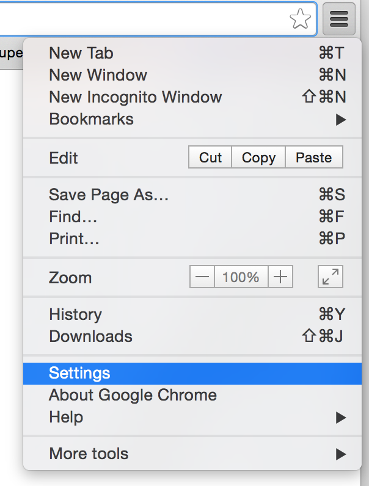
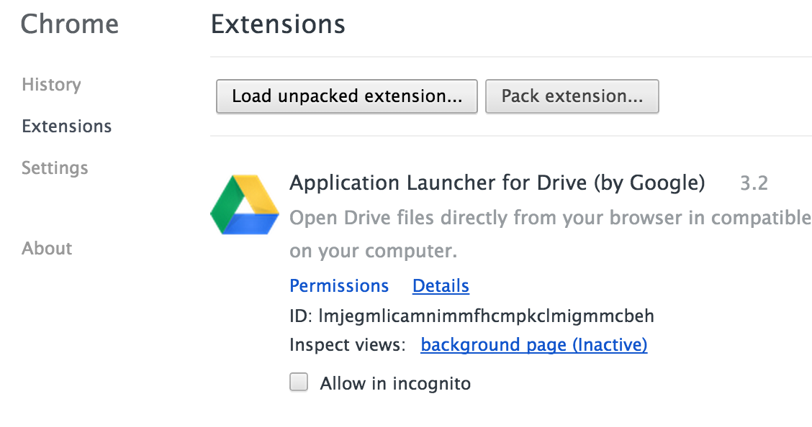

# Skipflix: Auto Skip Netflix Intros

Bothered by having to click "skip intro" on Netflix?
Skip opening credits automatically using this Chrome Extension.

## Done

- Set an interval to detect the skip button and click it when found.

## To Do

- Replace [`setInterval`][3] with an event listener (?) to detect the skip button.
- Option to skip only once (e.g. if you rewind the video, don't skip again).
- Option to skip either:
  - "previously on..."
  - opening credits
  - both (currently works like this)

## How to test it:

  ##### 1. Go to Google Chrome's settings

  

  ##### 2. Click Load Unpacked Extension and select the skipflix folder. Click OK

  

  ##### 3. Done! The extension will now be loaded on the browser and you can use it with any website by clicking the top right icon.

  

## Contributions

All types of contributions are welcome! You can help with:

- Design (would ❤️ a neat icon + cover on Chrome Web Store)
- Localization
- Grammar
- Coding

If you want to contribute code, please fork and [pull request][1].
For other contributions, [open an issue][2].
I'll try to answer as soon as possible.

[1]: https://github.com/jmosouza/skipflix/pulls
[2]: https://github.com/jmosouza/skipflix/issues
[3]: https://github.com/jmosouza/skipflix/blob/master/autoskip.js
